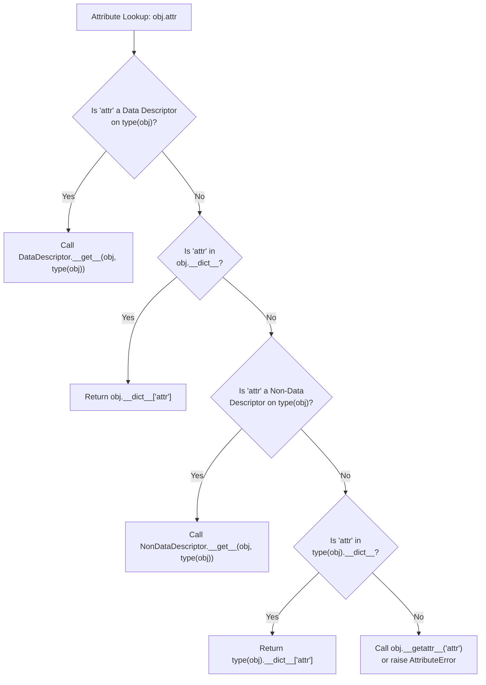
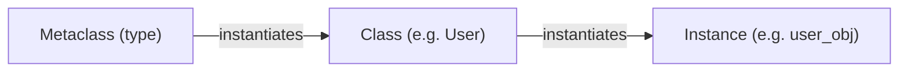

At the heart of Python's most powerful frameworks—Django's ORM models, Pydantic's data validation, SQLAlchemy's column mappings, and Python's own `@property` and methods—lies a single unified mechanism: **The Descriptor Protocol**.

Beyond descriptors sits Python's ultimate tier of abstraction: **Metaprogramming**—the ability of code to inspect, alter, synthesize, and register classes at runtime.

In this comprehensive article, based on Part 4 of Fred Baptiste's *Python Series*, we dissect the descriptor protocol, trace attribute resolution precedence, build robust declarative validators, examine `type()` class creation, and harness modern class customization via `__init_subclass__` and metaclasses.

---

## 1. The Descriptor Protocol: The Engine of Python Attributes

A **descriptor** is an object attribute with "binding behavior"—one whose attribute access is overridden by methods in the descriptor protocol:

```python
class DescriptorProtocol:
    def __get__(self, instance, owner=None):
        """Called when attribute is accessed: obj.attr or Class.attr"""
        ...

    def __set__(self, instance, value):
        """Called when attribute is assigned: obj.attr = value"""
        ...

    def __delete__(self, instance):
        """Called when attribute is deleted: del obj.attr"""
        ...

    def __set_name__(self, owner, name):
        """Called when the owner class is constructed (Python 3.6+)"""
        ...
```

> [!NOTE]
> Descriptors **must** be declared at the **class level**, never inside `__init__` on an instance.

---

## 2. Data vs. Non-Data Descriptors & Lookup Precedence

Python categorizes descriptors based on the methods they implement:
- **Data Descriptor:** Implements `__set__` and/or `__delete__` (e.g., `@property` with a setter).
- **Non-Data Descriptor:** Implements only `__get__` (e.g., standard methods, `@staticmethod`, `@classmethod`).

This distinction governs Python's fundamental attribute lookup priority:



### Demonstrating the Difference:
```python
class NonDataDescriptor:
    def __get__(self, instance, owner):
        return "from non-data descriptor"

class DataDescriptor:
    def __get__(self, instance, owner):
        return "from data descriptor"
    
    def __set__(self, instance, value):
        print(f"Setting data descriptor to {value}")

class Example:
    nd = NonDataDescriptor()
    d = DataDescriptor()

obj = Example()

# 1. Non-Data Descriptor can be shadowed by instance dictionary:
print(obj.nd)  # "from non-data descriptor"
obj.__dict__["nd"] = "shadowed value in instance dict"
print(obj.nd)  # "shadowed value in instance dict"

# 2. Data Descriptor CANNOT be shadowed by instance dictionary:
print(obj.d)   # "from data descriptor"
obj.__dict__["d"] = "trying to shadow"
print(obj.d)   # Still prints "from data descriptor"! (Data descriptor wins)
```

---

## 3. Building Production Validators with `__set_name__`

Before Python 3.6, descriptors did not know the attribute name they were assigned to unless explicitly told (`age = Integer("age")`). PEP 487 added `__set_name__`, eliminating this boilerplate entirely:

```python
class IntegerField:
    def __init__(self, min_val: int = None, max_val: int = None):
        self.min_val = min_val
        self.max_val = max_val

    def __set_name__(self, owner, name):
        # Automatically called with owner=User, name='age'
        self.storage_name = f"_{name}"

    def __get__(self, instance, owner):
        if instance is None:
            return self  # Accessing via User.age returns the descriptor itself
        return getattr(instance, self.storage_name, None)

    def __set__(self, instance, value):
        if not isinstance(value, int):
            raise TypeError(f"'{self.storage_name[1:]}' must be an integer, got {type(value).__name__}")
        if self.min_val is not None and value < self.min_val:
            raise ValueError(f"'{self.storage_name[1:]}' cannot be less than {self.min_val}")
        if self.max_val is not None and value > self.max_val:
            raise ValueError(f"'{self.storage_name[1:]}' cannot exceed {self.max_val}")
        
        # Store in instance __dict__ under private storage name
        setattr(instance, self.storage_name, value)

class UserAccount:
    age = IntegerField(min_val=18, max_val=120)
    score = IntegerField(min_val=0, max_val=1000)

    def __init__(self, age: int, score: int):
        self.age = age
        self.score = score

user = UserAccount(age=25, score=850)
print(f"User age: {user.age}, score: {user.score}")

try:
    user.age = 15  # Raises ValueError
except ValueError as e:
    print("Validation error:", e)
```

---

## 4. Dynamic Classes with `type()`

In Python, the `class` keyword is syntactic sugar. At runtime, classes are constructed by calling `type`:

```python
# The 3-argument form of type:
# type(class_name, tuple_of_base_classes, namespace_dict)
```

```python
def greet(self):
    return f"Hello, I am {self.name}!"

# Dynamically construct a class at runtime
PersonClass = type(
    "Person",                     # Class name
    (object,),                    # Base classes
    {                             # Class attributes & methods
        "species": "Homo sapiens",
        "greet": greet,
        "__init__": lambda self, name: setattr(self, "name", name),
    }
)

p = PersonClass("Alex")
print(p.species)   # "Homo sapiens"
print(p.greet())     # "Hello, I am Alex!"
print(type(p))       # <class '__main__.Person'>
```

---

## 5. Metaclasses: The Class of a Class

Just as an instance is created from a class, **a class is created from a metaclass**. The default metaclass in Python is `type`.



### The Metaclass Lifecycle
When a class statement finishes executing:
1. `Metaclass.__new__(mcs, name, bases, dct)`: Allocates and returns the new class object.
2. `Metaclass.__init__(cls, name, bases, dct)`: Initializes the newly created class object.
3. `Metaclass.__call__(cls, *args, **kwargs)`: Executed whenever the class is called to create an instance!

Let's build a metaclass that automatically enforces camelCase naming conventions and registers all model classes into a central registry:

```python
REGISTRY = {}

class AutoRegisterMeta(type):
    def __new__(mcs, name, bases, class_dict):
        # Validate that class name is Capitalized
        if not name[0].isupper():
            raise TypeError(f"Class '{name}' must start with an uppercase letter")
        
        # Inject an audit timestamp into every class
        class_dict["_registered_at"] = "2025-12-31T00:00:00Z"
        
        cls = super().__new__(mcs, name, bases, class_dict)
        
        # Don't register the base class itself
        if bases:
            REGISTRY[name] = cls
            print(f"[Registry] Registered model: {name}")
            
        return cls

class BaseModel(metaclass=AutoRegisterMeta):
    pass

class Product(BaseModel):
    pass

class Order(BaseModel):
    pass

print("Registry contents:", list(REGISTRY.keys()))
# [Registry] Registered model: Product
# [Registry] Registered model: Order
# Registry contents: ['Product', 'Order']
```

---

## 6. Modern Python Metaprogramming: `__init_subclass__` (PEP 487)

While metaclasses are exceptionally capable, they carry major friction:
- Complex syntax
- Severe metaclass conflict errors if two base classes have different metaclasses

In Python 3.6+, PEP 487 introduced `__init_subclass__`, which solves 95% of metaclass use cases with simple, idiomatic inheritance:

```python
PLUGIN_REGISTRY = {}

class PluginBase:
    def __init_subclass__(cls, plugin_name: str = None, **kwargs):
        super().__init_subclass__(**kwargs)
        
        name = plugin_name or cls.__name__.lower()
        PLUGIN_REGISTRY[name] = cls
        print(f"[Plugin Hook] Registered plugin '{name}' -> {cls.__name__}")

# Subclasses pass configuration directly in the class signature:
class JsonParserPlugin(PluginBase, plugin_name="json"):
    def parse(self, data): ...

class CsvParserPlugin(PluginBase, plugin_name="csv"):
    def parse(self, data): ...

print("Active plugins:", PLUGIN_REGISTRY)
# [Plugin Hook] Registered plugin 'json' -> JsonParserPlugin
# [Plugin Hook] Registered plugin 'csv' -> CsvParserPlugin
```

---

## 7. Metaprogramming Decision Matrix

When architecting advanced Python libraries and systems, choose the right level of abstraction:

| Technique | Complexity | Use Case |
| :--- | :--- | :--- |
| **Descriptors (`__get__`, `__set__`)** | Moderate | Attribute-level validation, lazy loading, ORM columns. |
| **Class Decorators (`@decorator`)** | Low-Moderate | Mutating a class after creation, adding mixins, modifying methods. |
| **`__init_subclass__`** | Low | Subclass registration, parameter verification, plugin architectures. |
| **Full Metaclasses (`type`)** | High | Controlling class namespace creation before execution (`__prepare__`), dynamic base class rewriting, deep framework internals. |

By mastering descriptors and modern metaprogramming hooks, you transition from simply writing Python scripts to crafting clean, declarative frameworks that other engineers love to build upon.

