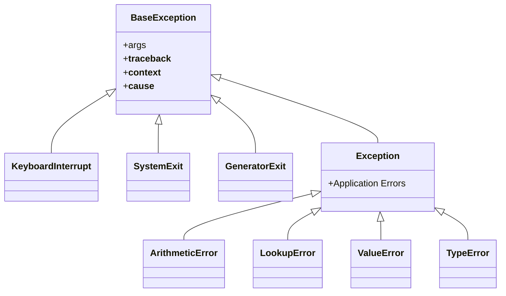

Clean architecture requires two pillars of defensive programming: **type-safe categorization** (preventing illegal application states) and **structured fault tolerance** (gracefully communicating and isolating failures).

Python provides high-level tools for both: the `enum` module for creating expressive, type-checked enumerations and bitmasks, and a rich, inspectable **Exception Hierarchy** supporting contextual error models and chaining.

In this comprehensive article, based on Part 4 Sections 10 & 12 of Fred Baptiste's *Python Series*, we master Python enumerations, build bitwise flags, design domain-specific exception hierarchies, trace PEP 3134 exception chaining, and inspect tracebacks.

---

## 1. The `enum` Module: Eliminating Magic Strings & Numbers

In legacy Python codebases, developers often used string literals or integer constants:
```python
# Fragile legacy pattern
STATUS_PENDING = 1
STATUS_APPROVED = 2
STATUS_REJECTED = 3

# Prone to typos, collisions, and zero type safety
def update_status(status: int): ...
```

The `enum` module provides **Enumerations**: symbolic names bound to unique, constant values.

```python
from enum import Enum, auto, unique

@unique  # Guarantees no two enum members share the same value
class OrderStatus(Enum):
    PENDING = "pending"
    PROCESSING = "processing"
    SHIPPED = "shipped"
    DELIVERED = "delivered"
    CANCELLED = "cancelled"

# Accessing members
status = OrderStatus.PROCESSING
print("Name :", status.name)   # "PROCESSING"
print("Value:", status.value)  # "processing"
print("Repr :", repr(status))  # <OrderStatus.PROCESSING: 'processing'>

# Identity and equality comparison
print(status is OrderStatus.PROCESSING)  # True
print(status == OrderStatus.PROCESSING)  # True
print(status == "processing")            # False! Type safety preserved
```

### Auto-Assigning Values with `auto()`
When the exact value does not matter as long as members are distinct:
```python
class HTTPMethod(Enum):
    GET = auto()
    POST = auto()
    PUT = auto()
    DELETE = auto()

print(list(HTTPMethod))  # [<HTTPMethod.GET: 1>, <HTTPMethod.POST: 2>, ...]
```

### Modern `StrEnum` (Python 3.11+)
If you need string interoperability (e.g. comparing directly with strings for JSON serialization):
```python
from enum import StrEnum

class Environment(StrEnum):
    DEVELOPMENT = "dev"
    STAGING = "staging"
    PRODUCTION = "prod"

# Directly compares equal to plain strings!
print(Environment.PRODUCTION == "prod")  # True
```

---

## 2. Bitwise Flags: Composable Permissions

Standard Enums represent mutually exclusive choices. When you need to represent **combinations** of options (such as user permissions or file modes), use `enum.Flag` or `enum.IntFlag`:

```python
from enum import Flag, auto

class Permission(Flag):
    NONE = 0
    READ = auto()     # 1
    WRITE = auto()    # 2
    EXECUTE = auto()  # 4
    ADMIN = READ | WRITE | EXECUTE  # 7

# Composing flags using bitwise OR (|)
user_perm = Permission.READ | Permission.WRITE
print("User permissions:", user_perm)
# Output: Permission.READ|WRITE

# Membership testing using the 'in' operator
print(Permission.READ in user_perm)     # True
print(Permission.EXECUTE in user_perm)  # False

# Modifying permissions
user_perm |= Permission.EXECUTE  # Add execute
user_perm &= ~Permission.WRITE   # Revoke write
print("Updated permissions:", user_perm)
# Output: Permission.READ|EXECUTE
```

---

## 3. Python's Built-in Exception Hierarchy

To handle errors effectively, you must understand the shape of CPython's exception inheritance tree:



> [!CAUTION]
> Notice that `KeyboardInterrupt` (Ctrl+C), `SystemExit` (`sys.exit()`), and `GeneratorExit` inherit directly from **`BaseException`**, **NOT** `Exception`!
> If you write:
> ```python
> try:
>     run_server()
> except BaseException:  # NEVER DO THIS!
>     pass
> ```
> Your program will ignore `Ctrl+C` and refuse to terminate! Always catch `except Exception:` in application code.

---

## 4. Designing Domain Exception Trees

Generic exceptions (`ValueError`, `RuntimeError`) make it impossible for callers to discriminate between distinct failure modes. Production systems should define a dedicated exception hierarchy:

```python
class ServiceException(Exception):
    """Base exception for all errors in our domain."""
    def __init__(self, message: str, error_code: str = "INTERNAL_ERROR", status_code: int = 500):
        super().__init__(message)
        self.message = message
        self.error_code = error_code
        self.status_code = status_code

    def to_dict(self):
        return {
            "error": self.error_code,
            "message": self.message,
            "status": self.status_code,
        }

class ValidationError(ServiceException):
    def __init__(self, message: str, invalid_field: str):
        super().__init__(message, error_code="INVALID_PAYLOAD", status_code=400)
        self.invalid_field = invalid_field

class ResourceNotFoundError(ServiceException):
    def __init__(self, resource: str, resource_id: str):
        super().__init__(f"{resource} with ID '{resource_id}' was not found", error_code="NOT_FOUND", status_code=404)

class PaymentGatewayError(ServiceException):
    def __init__(self, provider: str, original_code: str):
        super().__init__(f"Payment failed via {provider}: {original_code}", error_code="GATEWAY_FAILURE", status_code=502)
```

Now API handlers can catch specific domain errors cleanly:
```python
try:
    process_order(order_id="ord_123")
except ValidationError as e:
    return json_response(e.to_dict(), status=400)
except ResourceNotFoundError as e:
    return json_response(e.to_dict(), status=404)
except ServiceException as e:
    return json_response(e.to_dict(), status=e.status_code)
```

---

## 5. Exception Chaining: PEP 3134

When low-level library exceptions (like database errors or connection timeouts) occur, you often want to wrap them in higher-level domain exceptions without losing the original root cause.

Python supports two chaining mechanisms:

### 1. Explicit Chaining: `raise ... from <cause>`
Attaches the original exception as `__cause__`:

```python
import sqlite3

def fetch_user_balance(user_id: int):
    try:
        # Low-level call
        raise sqlite3.OperationalError("database is locked")
    except sqlite3.OperationalError as err:
        # Explicitly chain our domain exception to the database error
        raise ServiceException(f"Failed to fetch balance for user {user_id}") from err

# When an unhandled error prints to terminal:
# Output:
# sqlite3.OperationalError: database is locked
# The above exception was the direct cause of the following exception:
# ServiceException: Failed to fetch balance for user 42
```

### 2. Suppressing Chaining: `raise ... from None`
If an internal exception exposes sensitive infrastructure details or clutter (e.g. database connection strings or internal file paths), suppress the parent traceback:

```python
def authenticate_user(token: str):
    try:
        payload = verify_jwt(token)
    except Exception:
        # Completely suppresses internal verification tracebacks
        raise AuthenticationError("Invalid or expired session token") from None
```

---

## 6. Tracebacks and Introspection

Python allows programmatic inspection of the call stack at runtime:

```python
import sys
import traceback

def compute():
    raise ValueError("Invalid mathematical state detected")

try:
    compute()
except ValueError:
    exc_type, exc_val, exc_tb = sys.exc_info()
    
    # Format the entire stack trace into a list of strings
    formatted_tb = traceback.format_tb(exc_tb)
    print("Last frame function:", exc_tb.tb_frame.f_code.co_name)
    print("Line number:", exc_tb.tb_lineno)
```

---

## 7. Python 3.11+: `ExceptionGroup` and `except*`

In modern asynchronous systems, multiple concurrent coroutines or threads can fail simultaneously. Python 3.11 introduced `ExceptionGroup` and the `except*` syntax:

```python
# Synthesizing multiple independent errors
def run_concurrent_tasks():
    errors = [
        ValueError("Task 1 invalid value"),
        ConnectionError("Task 2 timeout"),
        ValueError("Task 3 negative dimension"),
    ]
    raise ExceptionGroup("Multiple worker failures", errors)

# Selective catching with except*
try:
    run_concurrent_tasks()
except* ValueError as eg:
    # Catches all ValueErrors inside the group!
    print(f"Handled {len(eg.exceptions)} ValueErrors: {eg.exceptions}")
except* ConnectionError as eg:
    # Catches all ConnectionErrors inside the group!
    print(f"Handled connection issue: {eg.exceptions}")
```

### Summary Best Practices
1. Use `@unique Enum` for mutually exclusive domain states and `Flag` for composable permission masks.
2. Never inherit custom exceptions from `BaseException`; always inherit from `Exception`.
3. Create a common base exception class for your package or microservice.
4. Use `raise ... from err` to preserve root-cause diagnostic telemetry, or `raise ... from None` to sanitize public errors.
5. In concurrent systems, leverage `ExceptionGroup` and `except*` to handle multiple failures without dropping errors.

