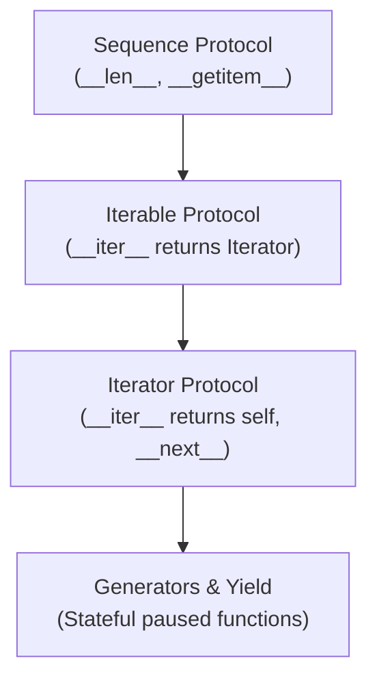

Iteration is the lifeblood of idiomatic Python. Almost everything we interact with—lists, strings, files, database cursors, and network streams—relies on Python's iteration architecture.

Yet many developers blur the boundaries between **iterables**, **iterators**, and **generators**. Understanding how Python traverses data under the hood unlocks the ability to stream massive datasets with a tiny, constant memory footprint ($O(1)$ RAM).

In this comprehensive article, based on Part 2 of Fred Baptiste's *Python Series*, we dissect the mechanics of `__iter__` and `__next__`, explore lazy evaluation with `yield`, master the `itertools` standard library, and build bidirectional coroutines.

---

## 1. The Iteration Hierarchy: Sequences vs Iterables vs Iterators

To understand Python iteration, we must understand the progression of protocols:



### 1. The Sequence Protocol
Before `__iter__` was formalized, Python used the Sequence Protocol: if an object defines `__getitem__` accepting integer indices `0, 1, 2...` and raises `IndexError` at the boundary, Python's `for` loop can iterate over it automatically.

```python
class LegacySequence:
    def __init__(self, data):
        self._data = data
        
    def __len__(self):
        return len(self._data)
        
    def __getitem__(self, index):
        return self._data[index]

seq = LegacySequence(["alpha", "beta", "gamma"])
for item in seq:
    print(item)  # alpha, beta, gamma
```

### 2. The Iterable Protocol
An **Iterable** is an object that can produce an Iterator. It implements `__iter__()`, which instantiates and returns a new iterator every time it is called.

### 3. The Iterator Protocol
An **Iterator** is an object with state that tracks its position during traversal. It implements two methods:
1. `__iter__()`: Returns `self`.
2. `__next__()`: Returns the next element, or raises `StopIteration` when traversal is finished.

```python
class CountdownIterator:
    def __init__(self, start: int):
        self.current = start
        
    def __iter__(self):
        return self
        
    def __next__(self):
        if self.current <= 0:
            raise StopIteration
        val = self.current
        self.current -= 1
        return val

counter = CountdownIterator(3)
print(next(counter))  # 3
print(next(counter))  # 2
print(next(counter))  # 1
# print(next(counter)) raises StopIteration!
```

---

## 2. Demystifying the `for` Loop Under the Hood

When you write `for item in collection:`, Python performs the following bytecode translation:

```python
# What you write:
# for item in collection:
#     process(item)

# What CPython actually executes:
iterator = iter(collection)  # Calls collection.__iter__() or uses fallback __getitem__
while True:
    try:
        item = next(iterator)  # Calls iterator.__next__()
    except StopIteration:
        break
    else:
        # Loop body
        print(f"Processing: {item}")
```

### The Sentinel Form of `iter()`
A lesser-known CPython superpower is the two-argument form: `iter(callable, sentinel)`. It invokes `callable()` repeatedly until the returned value equals `sentinel`:

```python
import random

# Roll a die until we roll a 6
roll_die = lambda: random.randint(1, 6)

for roll in iter(roll_die, 6):
    print(f"Rolled {roll}")
print("Hit 6! Loop terminated.")
```

This pattern is widely used for chunked I/O streaming:
```python
def read_binary_blocks(filepath, chunk_size=4096):
    with open(filepath, "rb") as f:
        # iter(lambda: f.read(chunk_size), b"") reads until empty bytes
        for block in iter(lambda: f.read(chunk_size), b""):
            process_block(block)
```

---

## 3. Generators and the Magic of `yield`

Writing custom classes with `__iter__` and `__next__` is verbose. **Generators** provide an elegant language-level syntax to define iterators using standard function syntax.

When a function contains the `yield` keyword, CPython flags it as a generator function (`CO_GENERATOR` flag). Calling it does not execute the function body; instead, it returns a generator object.

```python
def count_up_to(max_val):
    print("-> Generator started")
    count = 1
    while count <= max_val:
        print(f"-> Before yielding {count}")
        yield count
        print(f"-> Resumed after yielding {count}")
        count += 1
    print("-> Generator finished")

gen = count_up_to(2)
print("Created generator object:", gen)

print(next(gen))
print("---")
print(next(gen))
print("---")
# next(gen) raises StopIteration
```

### Execution Output:
```text
Created generator object: <generator object count_up_to at 0x7f...>
-> Generator started
-> Before yielding 1
1
---
-> Resumed after yielding 1
-> Before yielding 2
2
---
-> Resumed after yielding 2
-> Generator finished
StopIteration
```

### How CPython Suspends State
When a generator encounters `yield`:
1. The evaluated expression is returned to the caller.
2. The entire stack frame (local variables, instruction pointer, evaluation stack) is frozen in place inside a C heap structure (`PyGenObject`).
3. Execution control is yielded back to the caller.
4. When `next()` is called again, CPython restores the exact CPU instruction pointer and local frame variables and continues execution.

---

## 4. Generator Expressions & Memory Efficiency

Compare a list comprehension with a generator expression:

```python
import sys

# List comprehension: 10,000,000 integers materialized in memory
list_comp = [x ** 2 for x in range(10_000_000)]
print(f"List size in RAM : {sys.getsizeof(list_comp) / (1024 * 1024):.2f} MB")  # ~80 MB

# Generator expression: computed lazily on-demand
gen_exp = (x ** 2 for x in range(10_000_000))
print(f"Gen size in RAM  : {sys.getsizeof(gen_exp)} bytes")                     # ~104 bytes!
```

The generator expression takes roughly **104 bytes** regardless of whether it processes 10 elements or 10 billion elements.

---

## 5. Streaming Pipelines: Processing Terabytes in $O(1)$ RAM

Generators can be composed into declarative UNIX-like processing pipelines:

```python
def read_log_lines(file_path):
    """Simulate streaming an infinite or multi-gigabyte log file."""
    for line in open(file_path, "r"):
        yield line.strip()

def filter_errors(lines):
    """Filter only lines containing ERROR."""
    for line in lines:
        if "ERROR" in line:
            yield line

def extract_ip(error_lines):
    """Extract IP address from log message."""
    for line in error_lines:
        parts = line.split()
        yield parts[0]

def count_unique_ips(ips):
    """Accumulate unique IPs without loading all raw lines into memory."""
    seen = set()
    for ip in ips:
        if ip not in seen:
            seen.add(ip)
            yield ip

# Composing the pipeline:
# lines -> filter_errors -> extract_ip -> count_unique_ips
# No records are held in memory simultaneously!
```

---

## 6. The `itertools` Standard Library Superpowers

Python's built-in `itertools` module contains high-performance C-accelerated building blocks for iteration:

### 1. Slicing Infinite Streams: `itertools.islice`
Standard slicing `[start:stop]` does not work on generators because they do not implement `__getitem__`. `islice` solves this lazily:

```python
import itertools

def fibonacci():
    a, b = 0, 1
    while True:
        yield a
        a, b = b, a + b

# Take the first 10 Fibonacci numbers from an infinite generator
first_ten = list(itertools.islice(fibonacci(), 10))
print("First 10 Fibonacci:", first_ten)
# [0, 1, 1, 2, 3, 5, 8, 13, 21, 34]
```

### 2. Chaining Multiple Iterables: `itertools.chain`
```python
letters = ["a", "b", "c"]
numbers = [1, 2, 3]
symbols = ["!", "@", "#"]

combined = itertools.chain(letters, numbers, symbols)
print(list(combined))  # ['a', 'b', 'c', 1, 2, 3, '!', '@', '#']
```

### 3. Grouping Sorted Data: `itertools.groupby`
> [!IMPORTANT]
> `groupby` only groups **consecutive** duplicate keys. The input iterable must be sorted by the grouping key first!

```python
transactions = [
    {"dept": "Engineering", "amount": 1200},
    {"dept": "Engineering", "amount": 800},
    {"dept": "HR", "amount": 400},
    {"dept": "Sales", "amount": 2500},
    {"dept": "Sales", "amount": 1500},
]

for dept, group in itertools.groupby(transactions, key=lambda x: x["dept"]):
    total = sum(item["amount"] for item in group)
    print(f"Department: {dept.ljust(12)} -> Total Expense: ${total}")
```

### 4. Splitting Iterators: `itertools.tee`
Duplicates an iterator into $N$ independent iterators:
```python
data = [10, 20, 30, 40]
it1, it2 = itertools.tee(data, 2)

print(list(it1))  # [10, 20, 30, 40]
print(list(it2))  # [10, 20, 30, 40]
```

---

## 7. Coroutines: Bidirectional Communication with `.send()` and `yield from`

Generators are not just data producers; they can also be **data consumers**. When used this way, they are known as **coroutines**.

### Sending Values into a Suspended Generator
Using `val = yield`, a generator receives data passed by the caller via `generator.send(value)`:

```python
def running_averager():
    total = 0.0
    count = 0
    average = None
    while True:
        # yield returns current average, and evaluates to the sent value!
        term = yield average
        if term is None:
            break
        total += term
        count += 1
        average = total / count

avg_coroutine = running_averager()

# Prime the coroutine by advancing to the first yield
next(avg_coroutine)  # returns None

print(avg_coroutine.send(10))  # 10.0
print(avg_coroutine.send(20))  # 15.0
print(avg_coroutine.send(30))  # 20.0
avg_coroutine.close()
```

### Subgenerator Delegation: `yield from`
`yield from <iterable>` delegates control directly to another generator. It establishes a bidirectional pipeline where `.send()`, `.throw()`, and `.close()` pass straight through:

```python
def sub_worker():
    received = []
    while True:
        val = yield
        if val == "DONE":
            break
        received.append(val)
    return f"Processed {len(received)} items: {received}"

def orchestrator():
    result = yield from sub_worker()
    print(f"Orchestrator received return value: {result}")

orch = orchestrator()
next(orch)  # Prime the sub_worker

orch.send("Packet 1")
orch.send("Packet 2")
try:
    orch.send("DONE")
except StopIteration:
    pass
# Output: Orchestrator received return value: Processed 2 items: ['Packet 1', 'Packet 2']
```

This bidirectional delegation mechanism was the exact architectural foundation that paved the way for modern `async` and `await` in Python.

