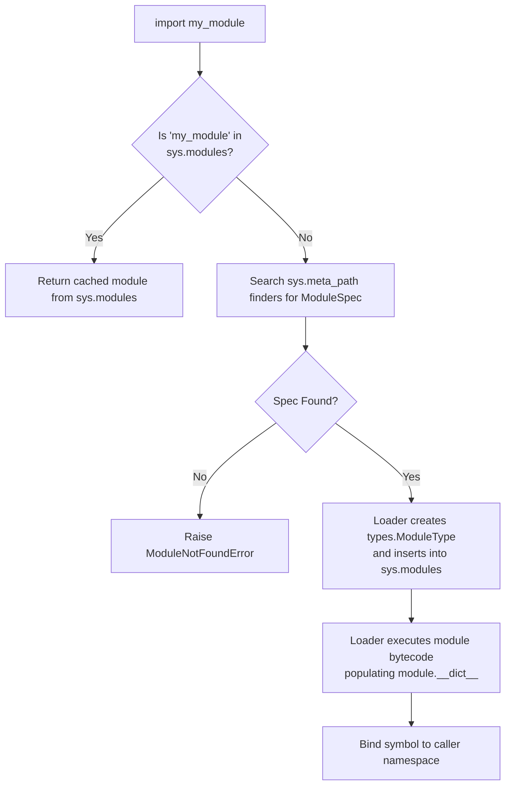
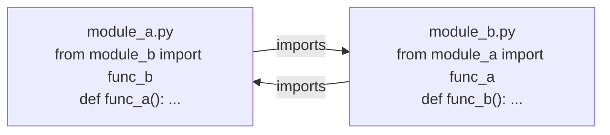

Every non-trivial Python project is composed of modules and packages. Yet many developers view the `import` statement as a black box—until confronted with a cryptic `ImportError: cannot import name ... (most likely due to a circular import)` or unexpected namespace collisions.

In Python, modules are not merely file paths; they are **first-class objects** (`types.ModuleType`) living in memory, cached in a global interpreter dictionary, and powered by an extensible finder/loader subsystem.

In this comprehensive article, based on Part 1 Section 09 of Fred Baptiste's *Python Series*, we dissect Python's import machinery, trace module caching in `sys.modules`, master package resolution, resolve circular imports cleanly, and harness PEP 420 namespace packages.

---

## 1. What is a Module in Python?

A Python module is simply a singleton instance of the built-in type `types.ModuleType`:

```python
import math
import types

print(type(math))  # <class 'module'>
print(isinstance(math, types.ModuleType))  # True
print(f"Module name: {math.__name__}")     # "math"
print(f"Module file: {getattr(math, '__file__', 'built-in')}")
```

Every module possesses its own namespace dictionary (`__dict__`). When code executes inside a module, the `globals()` function actually returns that module's `__dict__`!

```python
# A module is just a dictionary wrapper with attributes
print("pi" in math.__dict__)  # True
print(math.__dict__["pi"])    # 3.141592653589793
```

---

## 2. The Import Machinery: How CPython Resolves Imports

When you write `import my_module` or `from my_module import calculate`, Python performs the following step-by-step lifecycle:



### Step 1: Cache Inspection (`sys.modules`)
Python inspects `sys.modules`, a standard Python dictionary mapping module names (strings) to module objects:
```python
import sys

# If it is already in sys.modules, NO file I/O or compilation occurs!
print("sys" in sys.modules)    # True
print("math" in sys.modules)   # True
```

### Step 2: Finding the Module Specification (`sys.meta_path`)
If the module is not cached, Python iterates through a list of **meta path finders** in `sys.meta_path`:
1. `BuiltinImporter`: Finds C-level built-in modules like `sys`.
2. `FrozenImporter`: Finds frozen bytecode compiled into the Python binary.
3. `PathFinder`: Searches directories in `sys.path` for `.py`, `.pyc`, and C-extensions (`.so` / `.pyd`).

### Step 3: Module Instantiation and Bytecode Execution
Once the finder produces a `ModuleSpec`, the loader:
1. Allocates an empty `types.ModuleType(spec.name)`.
2. **Immediately registers this empty module into `sys.modules`** (before running its code!).
3. Compiles the file's Python code into bytecode (if no fresh `.pyc` exists).
4. Executes the bytecode in the module's `__dict__`.
5. Binds the module name into the importing file's local scope.

---

## 3. Packages vs. Modules: `__init__.py` and `__path__`

A **module** is a single file containing Python code (`math.py`).

A **package** is a module that can contain sub-modules and sub-packages. What makes a module a package is the presence of a `__path__` attribute:

```python
import os
import urllib
import urllib.request

print(hasattr(os, "__path__"))      # False (standard single-file module)
print(hasattr(urllib, "__path__"))  # True (it is a package!)
print(urllib.__path__)              # List of filesystem directories
```

### The Role of `__init__.py`
When a regular package is imported (`import mypkg`), Python locates the directory containing `__init__.py` and executes `__init__.py`. 

`__init__.py` serves three main roles:
1. **Package Initialization**: Executing setup code, initializing loggers, or configuring defaults.
2. **API Facade / Export Cleanliness**: Re-exporting nested classes so users write `from mypkg import Client` instead of `from mypkg.network.http.client import Client`.
3. **Controlling Wildcard Imports**: Defining the `__all__` list.

```python
# mypkg/__init__.py
from .network import Client
from .utils import format_payload

# Explicitly declare public exports for 'from mypkg import *'
__all__ = ["Client", "format_payload"]
```

---

## 4. PEP 420: Implicit Namespace Packages

Since Python 3.3 (PEP 420), a directory does **not** require an `__init__.py` to be importable! Directories without `__init__.py` are recognized as **Namespace Packages**.

```text
/company/
  ├── auth_service/
  │   └── acme/
  │       └── auth/
  │           └── login.py
  └── billing_service/
      └── acme/
          └── billing/
              └── invoice.py
```

Notice there is NO `__init__.py` inside either `acme/` directory. When both services are added to `sys.path`:
```python
# Both components merge seamlessly under the shared 'acme' namespace!
from acme.auth import login
from acme.billing import invoice

import acme
print(acme.__path__)
# _NamespacePath(['/company/auth_service/acme', '/company/billing_service/acme'])
```

This pattern is widely used in large enterprises and microservices to split one logical package (`google.cloud.*`, `azure.*`, `acme.*`) across completely independent Git repositories and Python packages.

---

## 5. Relative vs. Absolute Imports

Python supports two import styles:

### 1. Absolute Imports (Recommended)
Specifies the full path from the project root:
```python
# Fully qualified and unambiguous
from myapp.services.auth import AuthService
from myapp.database.connection import get_db
```

### 2. Relative Imports
Uses leading dots `.` to navigate relative to the current module's position:
- `from . import config` (same directory)
- `from .models import User` (sibling module)
- `from ..database import get_db` (parent directory)

> [!WARNING]
> Relative imports rely strictly on the module's `__name__` attribute (e.g., `myapp.services.auth`). If you attempt to run a file containing relative imports directly with `python myapp/services/auth.py`, `__name__` becomes `"__main__"`, and Python raises:
> `ImportError: attempted relative import with no known parent package`.
> Always run your application using the module flag: `python -m myapp.services.auth`.

---

## 6. The Circular Import Trap and How to Fix It

A **circular import** occurs when Module A imports Module B, and Module B imports Module A:



### Why Does It Crash?
Trace the execution:
1. Python starts executing `module_a.py`.
2. It encounters `from module_b import func_b`. Python halts execution of `module_a` and jumps to load `module_b`.
3. `module_b.py` starts executing. It reaches `from module_a import func_a`.
4. Python checks `sys.modules`. `module_a` is already in `sys.modules`!
5. Python attempts to read `func_a` from `module_a.__dict__`.
6. **Crash!** `func_a` has NOT been defined yet because `module_a` paused at line 1!
7. Python raises: `ImportError: cannot import name 'func_a' from partially initialized module 'module_a'`.

### Three Ways to Fix Circular Imports:

#### Solution 1: Refactor Shared Logic (Cleanest)
Extract the shared classes, interfaces, or functions into a new module (e.g., `models.py` or `common.py`) that both modules depend on.

#### Solution 2: Import the Module, Not the Symbol
Instead of importing the function directly, import the module namespace:
```python
# module_a.py
import module_b

def func_a():
    return module_b.func_b()  # Resolved at call time, not import time!
```

#### Solution 3: Defer the Import Inside the Function
```python
# module_a.py
def process():
    # Only imported when process() is called, well after all modules have initialized!
    from module_b import func_b
    return func_b()
```

---

## 7. Dynamic Imports with `importlib` and `__main__.py`

### Dynamic Loading with `importlib`
When building plugins or configurable drivers:
```python
import importlib

def load_plugin(plugin_path: str):
    # plugin_path = "plugins.analytics.MixpanelLogger"
    module_name, class_name = plugin_path.rsplit(".", 1)
    
    # Dynamically import the module
    mod = importlib.import_module(module_name)
    
    # Retrieve class object from module namespace
    cls = getattr(mod, class_name)
    return cls()
```

### Executable Packages with `__main__.py`
If you place a `__main__.py` file at the root of a package:
```text
my_cli/
  ├── __init__.py
  ├── __main__.py
  └── core.py
```

Users can invoke your package directly from the command line:
```bash
python -m my_cli --port 8080
```
CPython recognizes the `-m` flag, imports the package, and executes `__main__.py` as the entry point script.

