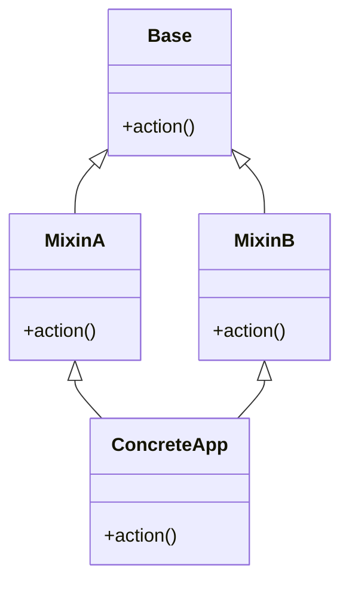

In Python, everything is an object—functions, modules, integers, and classes themselves. Yet Python's object-oriented architecture is markedly different from rigid class-based languages like Java or C++. 

Python classes and instances are dynamic namespaces backed by dictionaries, glued together by the descriptor protocol, and enriched by special "dunder" (double underscore) methods.

In this comprehensive article, based on Part 4 of Fred Baptiste's *Python Series*, we explore class and instance namespaces, trace method binding, overload operators cleanly, master C3 Linearization with `super()`, and optimize memory footprint using `__slots__`.

---

## 1. Class vs. Instance Namespaces & Method Binding

A class in Python is essentially a dictionary namespace created during definition. When an instance is created, it receives its own independent namespace:

```python
class Account:
    interest_rate = 0.05  # Class attribute (shared across instances)

    def __init__(self, owner: str, balance: float):
        self.owner = owner      # Instance attribute
        self.balance = balance  # Instance attribute

    def deposit(self, amount: float):
        self.balance += amount
```

### Namespace Lookup Resolution
When accessing `acc.interest_rate`:
1. Python checks `acc.__dict__`. Not found.
2. Python checks `Account.__dict__`. Found `0.05`!
3. If an attribute is assigned directly to the instance (`acc.interest_rate = 0.08`), it is stored in `acc.__dict__`, shadowing the class attribute for that specific instance only.

```python
acc1 = Account("Alice", 1000)
acc2 = Account("Bob", 2000)

print(acc1.__dict__)  # {'owner': 'Alice', 'balance': 1000}
print(Account.__dict__['interest_rate'])  # 0.05

# Shadowing
acc1.interest_rate = 0.08
print(acc1.interest_rate)  # 0.08 (from acc1.__dict__)
print(acc2.interest_rate)  # 0.05 (still reading Account.__dict__)
```

### The Magic of Bound Methods
Why does `acc.deposit(50)` automatically receive `self` without us passing it?

In Python, functions defined on classes are plain functions:
```python
print(type(Account.deposit))  # <class 'function'>
```

When accessed via an instance (`acc1.deposit`), Python invokes the function's `__get__` method (the descriptor protocol), which dynamically returns a **bound method** wrapping both the function and the instance:

```python
bound_m = acc1.deposit
print(bound_m)
# <bound method Account.deposit of <__main__.Account object at 0x...>>

# Calling bound_m(100) is bytecode-identical to:
# Account.deposit(acc1, 100)
```

---

## 2. String Representations: `__repr__` vs `__str__`

Python provides two primary dunder methods for string representation:

```python
class Money:
    def __init__(self, amount: float, currency: str = "USD"):
        self.amount = amount
        self.currency = currency

    def __repr__(self) -> str:
        """Unambiguous, reproducible developer representation."""
        return f"Money({self.amount!r}, {self.currency!r})"

    def __str__(self) -> str:
        """Human-readable display for users."""
        return f"${self.amount:,.2f} {self.currency}"

m = Money(12500.5, "USD")
print(str(m))   # "$12,500.50 USD"
print(repr(m))  # "Money(12500.5, 'USD')"
```

### Fallback Hierarchy
- If `__str__` is omitted, Python falls back to `__repr__`.
- If `__repr__` is omitted, Python uses the default object address string (`<Money object at 0x...>`).
- **Rule of Thumb:** Always implement `__repr__` first. It serves both developers and string formatting until a user-facing `__str__` is needed.

---

## 3. Operator Overloading: Arithmetic and Reflection

Python allows classes to intercept arithmetic operators via special dunders:

```python
class Vector:
    def __init__(self, x: float, y: float):
        self.x = x
        self.y = y

    def __repr__(self):
        return f"Vector({self.x}, {self.y})"

    # Normal addition: v1 + v2
    def __add__(self, other):
        if isinstance(other, Vector):
            return Vector(self.x + other.x, self.y + other.y)
        if isinstance(other, (int, float)):
            return Vector(self.x + other, self.y + other)
        return NotImplemented

    # Reflected addition: 10 + v1
    def __radd__(self, other):
        # Addition is commutative, delegate to __add__
        return self.__add__(other)

    # In-place addition: v1 += 5
    def __iadd__(self, other):
        if isinstance(other, Vector):
            self.x += other.x
            self.y += other.y
            return self
        if isinstance(other, (int, float)):
            self.x += other
            self.y += other
            return self
        return NotImplemented

v1 = Vector(2, 3)
v2 = Vector(4, 5)

print("v1 + v2 =", v1 + v2)      # Vector(6, 8)
print("10 + v1 =", 10 + v1)      # Vector(12, 13) (invoked __radd__)

v1 += 5
print("v1 after += 5:", v1)      # Vector(7, 8)
```

> [!NOTE]
> Return `NotImplemented` (not `raise NotImplementedError`) when an operator does not support a given operand type. This signals Python to attempt the reflected operator (`__radd__`) on the right-hand operand before raising a `TypeError`.

---

## 4. Rich Comparisons & `@functools.total_ordering`

To allow sorting and comparison (`<`, `<=`, `==`, `>=`, `>`), you can implement comparison dunders:
- `__eq__`, `__ne__`
- `__lt__`, `__le__`
- `__gt__`, `__ge__`

Instead of writing all six methods, implement `__eq__` and `__lt__`, then apply `@functools.total_ordering`:

```python
from functools import total_ordering

@total_ordering
class Task:
    def __init__(self, priority: int, title: str):
        self.priority = priority
        self.title = title

    def __eq__(self, other):
        if not isinstance(other, Task):
            return NotImplemented
        return (self.priority, self.title) == (other.priority, other.title)

    def __lt__(self, other):
        if not isinstance(other, Task):
            return NotImplemented
        return self.priority < other.priority

    def __repr__(self):
        return f"Task({self.priority}, '{self.title}')"

t1 = Task(1, "Deploy to prod")
t2 = Task(5, "Write documentation")
t3 = Task(1, "Fix critical bug")

print(t1 < t2)   # True
print(t2 >= t1)  # True (synthesized automatically by @total_ordering)
print(sorted([t2, t1, t3]))
# [Task(1, 'Deploy to prod'), Task(1, 'Fix critical bug'), Task(5, 'Write documentation')]
```

---

## 5. Multiple Inheritance, MRO, and `super()`

Python supports multiple inheritance using the **C3 Linearization Algorithm** to determine the Method Resolution Order (MRO).



### The Diamond Problem and `super()`
Consider this cooperative inheritance chain:

```python
class Root:
    def process(self):
        print("Root.process")

class FilterA(Root):
    def process(self):
        print("FilterA: before")
        super().process()
        print("FilterA: after")

class FilterB(Root):
    def process(self):
        print("FilterB: before")
        super().process()
        print("FilterB: after")

class Pipeline(FilterA, FilterB):
    def process(self):
        print("Pipeline: start")
        super().process()
        print("Pipeline: end")

p = Pipeline()
p.process()
```

### Execution Output:
```text
Pipeline: start
FilterA: before
FilterB: before
Root.process
FilterB: after
FilterA: after
Pipeline: end
```

Notice that `FilterA` called `super().process()`, and Python called `FilterB.process()`, even though `FilterB` is **not** a parent of `FilterA`!

### Inspecting the MRO
We can inspect the exact linearized search order:
```python
print([cls.__name__ for cls in Pipeline.__mro__])
# ['Pipeline', 'FilterA', 'FilterB', 'Root', 'object']
```

`super()` looks up the *next class in the instance's MRO*, not the parent class in the lexical file. This cooperative design allows mixins to chain cleanly without hardcoding base dependencies.

---

## 6. Memory Optimization with `__slots__`

By default, every Python instance has an internal dictionary `__dict__` to hold arbitrary attributes at runtime. While flexible, a dictionary requires substantial memory overhead (~150 to 200 bytes per instance).

If you are instantiating millions of small objects (e.g., telemetry points, graph nodes, pixels), this overhead becomes prohibitive. `__slots__` tells CPython to allocate a fixed-size C array for attributes instead:

```python
import sys

class DictPoint:
    def __init__(self, x, y):
        self.x = x
        self.y = y

class SlottedPoint:
    __slots__ = ("x", "y")  # Eliminates __dict__ and __weakref__
    
    def __init__(self, x, y):
        self.x = x
        self.y = y

dp = DictPoint(1, 2)
sp = SlottedPoint(1, 2)

# Size of instance struct itself + dict
dict_size = sys.getsizeof(dp) + sys.getsizeof(dp.__dict__)
slot_size = sys.getsizeof(sp)

print(f"Standard instance memory: {dict_size} bytes")
print(f"Slotted instance memory : {slot_size} bytes")
```

### Memory Benchmark Results
- **Standard class:** ~152 bytes per instance
- **Slotted class:** ~48 bytes per instance (~**68% memory savings!**)
- **Speed:** Attribute access on slotted classes is approximately 20% faster due to direct C pointer offset indexing rather than dictionary hash lookups.

> [!CAUTION]
> When using `__slots__`, dynamic attribute assignment (`obj.new_attr = 10`) will raise `AttributeError` unless you explicitly include `'__dict__'` in `__slots__`.

